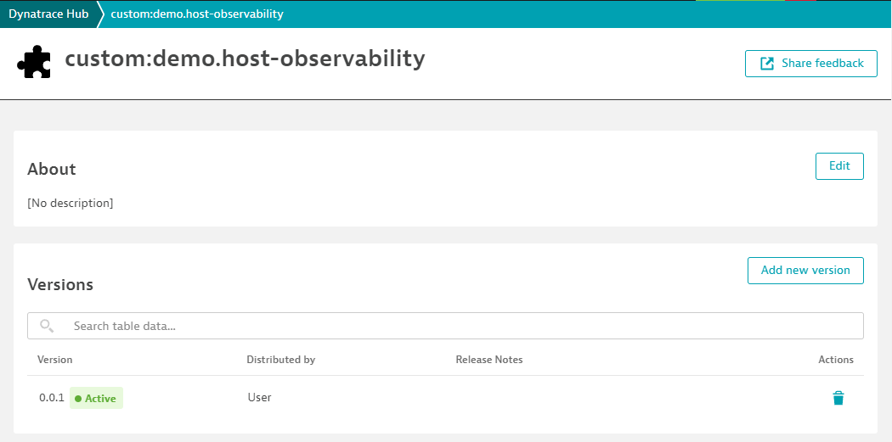

# Exercise 1 - A basic Extension 2.0
---
## Description
Extensions 2.0 are mainly based on a YAML file. The YAML file has minimum requirements to be valid:
* name - which must begin with `custom:` for custom extensions
* version
* author

You can also use `minDynatraceVersion` to enforce a minimum version of extension schema and EEC (ActiveGate or OneAgent)

Once ready, the YAML file needs to be archived into `extension.zip` which then needs signing, thus creating a `extension.zip.sig`. These two files then need to be zipped up into another archive which Dynatrace is ready to accept.

**How to sign your extension archive:**

Option 1 - OpenSSL
```shell
openssl cms -sign -signer developer.pem -inkey developer.key -binary -in extension.zip -outform PEM -out extension.zip.sig
```
Option 2 - dt-cli
```shell
python dt.py extension build --extension-directory <path> --target-directory <path> --certificate dev.pem --private-key dev.key
```

**How to upload your extension to Dynatrace:**

Go to `Extensions` from the main menu, click `Upload custom Extension 2.0` and upload your file.

## Tasks
1. Create a `extension` folder on your computer
2. Create a `extension.yaml` inside that folder
3. Add the minimum information required for Extension 2.0 in the `extension.yaml` file
4. Sign your extension
5. Upload your extension archive to Dynatrace

## Results
You have completed the exercise when your extension shows up in Dynatrace as Active.



---
## [Next exercise ▶](../2_WMI-DataSource)
