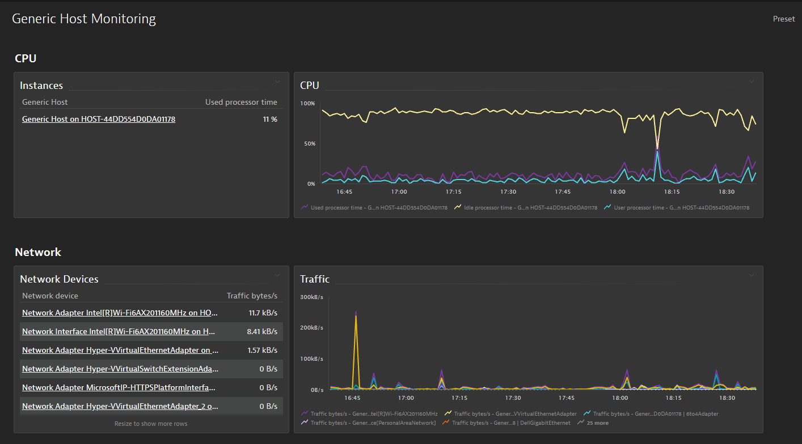

# Exercise 6 - Packaging Assets
---

## Description

With extensions 2.0 you can now package the expertise required to monitor a new technology in the form of dashboards and custom alerts. These are made available within the Dynatrace tenant as soon as the extension is deployed.

Dashboards and alerts must be packaged as JSON files (content is the same as an API export) as part of your `extension.zip` archive and are referenced in YAML within the `dashboards` and `alerts` sections. Items in these lists map to paths relative to the extension archive.

Example:
```yaml
dashboards:
  - path: dashboards/dashboard.json
alerts:
  - path: alerts/alert.json
```

## Tasks
1. Download the [assets](./assets/) folder provided with this exercise
2. Save it next to the `extension.yaml`
3. Add the `dashboards` and `alerts` sections to `extension.yaml`
4. Package and upload a new version of your extension
5. Validate the Dashboard and Alert have appeared in your tenant

## Results
You have completed this exercise when you can verify a dashboard called "Generic Host Monitoring" and an alert called "CPU Saturation" have appeared in your tenant.



---
## Congrats! You've finished all exercises!

#### [◀ Back to intro](../)
